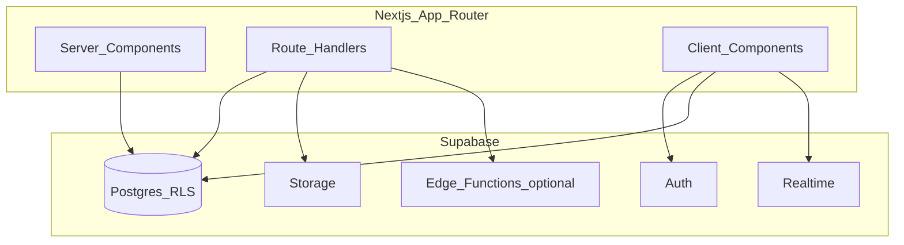

# ShareParty Web — Build Plan

| Field | Value |
|-------|--------|
| **Status** | Active — canonical plan for this repository |
| **Supersedes** | `OPERATOR_WEB_BUILD_PLAN.md` (archived); legacy `ShareParty_25Day_BuildPlan (1).docx` is **not** the programme-of-record for ShareParty-Web scope |
| **Last updated** | April 2026 |
| **Stack** | **Next.js** (App Router) + **Supabase** (Postgres, Auth, Storage, Realtime) |

This document defines what to build for **ShareParty-Web**: a **web-first operator console** on **Next.js** backed by **Supabase** — Postgres for relational data, **Supabase Auth** for identity, **Row Level Security (RLS)** and `library_id` for multi-tenancy, **Storage** for toy and return photos (signed URLs), and **Realtime** (or broadcast patterns) for availability — with **minimal member surfaces** only where pilots cannot run without them. Mobile remains the **primary capture path for return photos**; **AI condition analysis and operator decisions** happen on the web. **Stripe** (Connect and BYO) and other privileged work run in **Next.js Route Handlers** or **Supabase Edge Functions** with the **service role** only on the server — never in the browser for secrets.

### Architecture snapshot

---

## 1. Product intent

Operators run libraries: **catalogue**, **loans and returns**, **members**, **reservations and waitlists**, **payments**, and **notifications**. The web app is the control plane. Members may use web for browse, reserve, shelf, and billing links as needed.

**Differentiators to preserve:** model-agnostic AI **ingest** and **return inspection** (with raw model payload stored), toy **state machine**, real-time availability, queue-backed email.

---

## 2. Success criteria

| Outcome | How you know |
|---------|----------------|
| Library goes live end-to-end | New operator finishes onboarding (account → locale → library settings → **payments branch** → legal acknowledgements → go-live) in **under 30 minutes** |
| Catalogue is operable at pilot scale | CRUD, photos, colour + text labels, state transitions, SETLS / MiBase NZ import |
| Lending loop works cross-surface | Loan → **mobile return upload** → **web** comparison + AI inspection + operator fee/no-fee decision → notifications |
| Money and access stay correct | Per-library Stripe mode (Connect **or** BYO keys): subscriptions, damage fees, webhooks → membership state; idempotent handlers |
| Concurrent use is safe | Realtime updates under ~2s for status; invalid state transitions and double-reservation rejected in **Postgres (constraints/RPC) or server routes** |

---

## 3. Operator capability map

### 3.1 Library and organisation

- Tenant routing (slug/subdomain); **every** query and mutation scoped by `library_id`.
- **Onboarding** after library settings: **payments branch**
  - **Platform paywall:** Stripe Connect (operator onboarding, payouts, platform fees if product requires).
  - **No platform paywall (library-owned Stripe):** **BYO Stripe setup** — restricted secret + publishable keys, webhook signing secret, server-side verify (e.g. test API call), plain-language security and rotation copy; funds settle in **their** Stripe account.
- DPA / COPPA operator steps and go-live for **both** branches (legal copy may differ when platform does not hold funds).
- **Localisation from day one:** currency (minor units + ISO), dates, i18n scaffold — before large UI volume.

### 3.2 Catalogue

- Toy CRUD; **Supabase Storage** signed uploads; optional QR display/download (PDF label printers = later).
- **Colour status** (Green / Amber / Red / Grey) + **mandatory text labels** (WCAG).
- **State machine:** Available → Reserved → On Loan → Under Inspection → Available | Retired; reject invalid transitions in **database-enforced rules and/or Next server actions / Route Handlers**.
- **AI ingest:** web upload 1–4 photos → vision service → operator confirmation; editable alt text and fields.
- **CSV:** SETLS + MiBase NZ only — preview, confirm, import toys, members, loan history; stock-photo flag on imports.

### 3.3 Members

- Operator search/detail/history; minimal children data (age + optional name); delete child without nuking parent account where spec requires.
- COPPA-aware flows for US-facing sign-up where applicable.

### 3.4 Loans, reservations, waitlist

- Dashboard: quick loan / quick return; action queues.
- **Returns:** **Mobile** — QR/loan id, 1–4 photos, upload via **Storage signed URL** (or authenticated upload endpoint); row updates on `loan` / `condition` in Postgres. **Web** — side-by-side (or stacked) outgoing vs return images; run **AI condition inspection**; operator: no charge / damage fee / flag; persist **raw AI JSON**.
- Optional **web-only** emergency return upload; does not replace mobile path.
- Reservations: holds (e.g. 48h after next session); server-side conflict handling.
- Waitlist: join + position; **operator manual advance** at pilot scale.

### 3.5 Payments (Stripe abstraction)

- **`billing_mode` per library** + server-side factory (Route Handler / Edge Function): Connect (`Stripe-Account`) vs **decrypted BYO** Stripe client using keys loaded from **encrypted columns** (or Supabase Vault if adopted).
- Subscriptions, Customer Portal, damage charges, webhooks — all resolve **library → Stripe identity**; webhook verification uses **library-scoped** signing secret; idempotency key = library + Stripe event id (or equivalent).
- **Secrets:** encrypt at rest; server-only; rotate/re-verify in settings; no secrets in logs or browser.

### 3.6 Notifications and real time

- **Supabase Realtime** (or Postgres `LISTEN`/`NOTIFY` via Edge) for library-scoped channels; toy/status events; signal operator when **mobile return upload** completes.
- **Queue-backed outbound mail** (no fire-and-forget from user-facing routes): e.g. **Supabase Edge Functions** + external queue (Inngest, Trigger.dev, Cloudflare Queues) or **pg_net** / scheduled jobs — pick one pattern and stay consistent.
- Minimum **five** transactional emails (loan confirmed, overdue, damage fee, reservation ready, billing) — MJML + provider (e.g. Postmark), invoked from workers/Edge, not directly from React render paths.
- Operator in-app notification centre (**Realtime** subscriptions + read state in Postgres).
- Compliance: unsubscribe on non-transactional, sender address, marketing opt-in only.

### 3.7 Dashboard

- Today / queue / quick actions / recent activity backed by **Supabase queries (RLS-scoped)** or server data loaders; filters for catalogue and members.

---

## 4. Scope boundaries

### 4.1 In scope (this repo / operator-web programme)

Section 3 in full; foundation (**Next.js app**, **Supabase project**: SQL migrations, tables including `billing_mode` and encrypted BYO fields, **RLS policies** per `library_id`, **Auth** with email verification and optional custom claims for operator vs member); **Storage** buckets and policies for toys and returns; **mobile** uploads using **short-lived signed URLs** or authenticated session; **Realtime**; queue-backed email + Postmark (or equivalent); AI services (Route Handlers / Edge with model API keys); E2E on critical paths **for both billing modes**; manual WCAG on **operator** UI.

### 4.2 De-emphasised

| Area | Approach |
|------|----------|
| Catalogue AI photos | **Web upload** primary for ingest; mobile ingest optional later |
| Member portal | **Minimal** routes for pilot E2E; polish after operator console |
| Native push | After native apps |

### 4.3 Explicitly out of scope (v1 / post-pilot)

Multi-region AWS, GDPR/CASL package beyond pilot, arbitrary CSV AI mapping, automated stock photo fetch, operator analytics dashboard, Brother QL PDF pipeline, full audit log, full 14+ notification matrix, waitlist auto-advance, volunteer tiers, white-label, multi-location, Stripe Tax US, VPAT/pen/SOC2, etc. — add when product asks.

---

## 5. Delivery phases

Rough effort band **~100–140 hrs** if building full pilot stack; order is **operator-first**.

| Phase | Focus | Deliverables |
|-------|--------|----------------|
| **A — Foundation** | Platform base | Next.js operator app + **Supabase** (project, migrations, RLS, Auth email flows); optional Turborepo mono; CI; roles/age gate (Auth + app metadata or profiles table); **tenancy**; onboarding including **Connect vs BYO branch** (server routes); locale+i18n; COPPA/children rules; **staging** (e.g. Vercel + Supabase hosted) before heavy feature work |
| **B — AI + catalogue** | Highest schedule risk | Model-agnostic vision service; **Storage** signed uploads; **prompt iteration block** on real toys (target **>85%** branded baseline); web ingest UI; CRUD + colour + state machine; dashboard shell; SETLS/MiBase import |
| **C — Lending + real time** | Cross-surface returns | Mobile return upload (Storage + Postgres); web **return inspection** UI; AI inspection + decisions; **Realtime** + reservation races; events when uploads complete |
| **D — Members + payments** | Money correctness | Operator member UI; minimal member web; Stripe **abstraction** in server routes — Portal, subscriptions, damage charges, webhooks — **tested per `billing_mode`** |
| **E — Notifications + launch** | Reliability + ship | Central job/queue fan-out; five MJML templates; operator notification centre (**Realtime**); E2E (ingest, loan, mobile return, web inspection, conflict, payment fail, **BYO webhook path**); WCAG manual pass; pilot checklist |

---

## 6. Non-negotiables

- Auth, tenancy, and locale **before** large UI.
- Toy **state machine** enforced in **Postgres and/or server routes** (never client-only).
- **AI ingest + web return inspection** (mobile photos, web analysis, stored evidence).
- **Stripe correct for library billing mode** (Connect **or** BYO + webhooks).
- **Supabase Realtime** (or equivalent) for availability and operator awareness of returns.
- COPPA/minimal child data rules live before production operators.
- Transactional email via **queue**, not inline fire-and-forget.

---

## 7. Risks

| Risk | Response |
|------|-----------|
| Vision prompt quality | Calendar time + frozen photo eval set; do not skip |
| Reservation races | Two-client tests when **Realtime** ships |
| Stripe (Connect, BYO, webhooks) | Idempotency, logging, CLI simulations; **never** mix webhook secrets across libraries |
| WCAG | Text with every colour badge; keyboard operator flows |

---

## 8. Launch checklist

- [ ] Onboarding under 30 minutes (both payment branches smoke-tested).
- [ ] AI ingest meets bar on agreed photo set.
- [ ] ingest → loan → **mobile return** → **web AI + operator decision** → fee (if any) → email.
- [ ] Two sessions, one toy: second reservation fails cleanly.
- [ ] Connect library: test payout + renewal (test mode).
- [ ] BYO library: keys saved, charge + `payment_failed` → membership (test mode).
- [ ] COPPA / child delete (US-locale scenario).
- [ ] Operator UI: labels, alt text, keyboard.
- [ ] Critical emails in major clients.
- [ ] **Realtime** latency acceptable under manual load.
- [ ] Staging burn-in; pilot briefing + hardware.

---

## 9. Execution discipline

- One tight task per session (one route, one RPC policy bundle, or one major UI slice).
- Review before stacking dependents; **do not** start catalogue-heavy work until A is solid on staging.
- No scope drift into §4.3 without explicit reprioritisation.
- From Phase E onward: **all** outbound notification triggers go through the central bus.

---

## 10. Naming note (paywall vs Stripe owner)

If “paywall” in product language only means “member must pay to borrow,” still implement **billing_mode** by **who owns the Stripe account**: **platform** → Connect; **library** → BYO keys.

---

*End of canonical build plan. Schema and RLS live in Supabase migrations; implementation detail lives in the Next.js repo and ADRs as they appear.*
